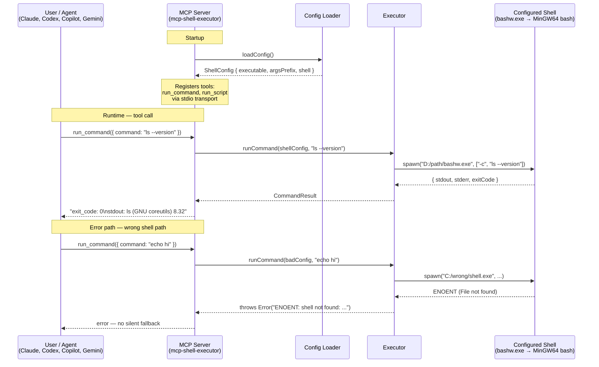

# mcp-shell-executor

An MCP (Model Context Protocol) server that runs shell commands through a **explicitly configured shell** — ignoring whatever default shell the AI agent runtime detects from the OS.

Built for Windows environments where agents keep drifting to `powershell.exe` instead of `bashw` (Git Bash / MinGW64).

---

## The Problem It Solves

Every AI agent runtime (Claude/Copilot, Codex, Gemini, Antigravity) auto-detects the host OS default shell at startup. On Windows that means `powershell.exe`. This breaks:

- POSIX commands (`ls`, `grep`, `find`) resolve to Windows system binaries with different semantics
- JBang scripts require `bashw -c 'jbang ...'` to work correctly
- Path models clash (`C:\foo` vs `/c/foo`)
- Shell operators (`&&`, `2>&1`, heredocs) behave differently or fail

This MCP is the **single, agent-agnostic fix**: configure your shell once, and every agent that connects gets exactly that shell.

---

## How It Works



### Step by step

**1. Startup — config is loaded once**

When the MCP server starts, it reads `ShellConfig` from one of two places (CLI flag wins over env var):

```
--shell-config '{"executable":"D:/path/bashw.exe","argsPrefix":["-c"],"shell":"bash"}'
```
or
```
MCP_SHELL_CONFIG={"executable":"...","argsPrefix":["-c"],"shell":"bash"}
```

If no config is found, the server **refuses to start** — there is no default shell fallback.

**2. Tool registration**

The server announces two tools to the agent runtime over stdio (MCP standard transport):

| Tool | Input | Use |
|------|-------|-----|
| `run_command` | `{ command: "string" }` | Single command |
| `run_script` | `{ script: "string" }` | Multi-line script body |

**3. Tool call — agent sends a command**

When the agent calls `run_command({ command: "ls --version" })`, the executor does exactly:

```
spawn("D:/home/raiser-apps/shims/bashw.exe", ["-c", "ls --version"])
```

The command string is passed **verbatim** — no mangling, no path conversion. The configured shell owns its own PATH and semantics.

**4. Result returned**

```
exit_code: 0
stdout:
ls (GNU coreutils) 8.32
stderr: (empty)
```

**5. Failure — hard stop, no fallback**

If the shell binary doesn't exist, the server returns a clear `ENOENT` error. It never silently falls back to `powershell.exe` or `cmd.exe`.

---

## Configuration

The config shape (modeled on Gemini's `GEMINI_SHELL_CONFIG`):

```json
{
  "executable": "D:/home/raiser-apps/shims/bashw.exe",
  "argsPrefix": ["-c"],
  "shell": "bash"
}
```

| Field | Required | Description |
|-------|----------|-------------|
| `executable` | ✅ | Absolute path to shell binary. Include `.exe` on Windows. |
| `argsPrefix` | ✅ | Arguments before the command. `-c` for bash/sh, `/c` for cmd. |
| `shell` | — | Label for logging. Does not affect execution. |

### Platform examples

| Platform | Config |
|----------|--------|
| Windows + bashw (this workspace) | `{"executable":"D:/home/raiser-apps/shims/bashw.exe","argsPrefix":["-c"],"shell":"bash"}` |
| Windows + PowerShell 7 | `{"executable":"D:/home/raiser-apps/shims/pwsh.exe","argsPrefix":["-Command"],"shell":"pwsh"}` |
| Linux / macOS | `{"executable":"/bin/bash","argsPrefix":["-c"],"shell":"bash"}` |
| WSL bash | `{"executable":"C:/Windows/System32/wsl.exe","argsPrefix":["--","/bin/bash","-c"],"shell":"wsl-bash"}` |

---

## Running

```bash
# From GitHub — no install, Deno fetches and runs directly
MCP_SHELL_CONFIG='{"executable":"/usr/bin/bash","argsPrefix":["-c"],"shell":"bash"}' \
  deno run --allow-env --allow-run \
  https://raw.githubusercontent.com/raisercostin/mcp-shell/main/src/main.ts

# Pinned to a release tag
deno run --allow-env --allow-run \
  https://raw.githubusercontent.com/raisercostin/mcp-shell/v1.0.0/src/main.ts

# From a local clone
deno run --allow-env --allow-run src/main.ts
```

### Install in your AI agent

Set your shell config once in an env var, then register the server with one command.
Deno fetches and runs the source directly from GitHub — no install step needed.

```bash
# Set this in your shell profile (.bashrc / .zshrc / $PROFILE) so all agents inherit it
export MCP_SHELL_CONFIG='{"executable":"/usr/bin/bash","argsPrefix":["-c"],"shell":"bash"}'
# Windows + bashw:
# $env:MCP_SHELL_CONFIG='{"executable":"D:/path/to/bashw.exe","argsPrefix":["-c"],"shell":"bash"}'
```

---

#### Claude (`claude` CLI — Claude Code)

```bash
claude mcp add shell -e MCP_SHELL_CONFIG="$MCP_SHELL_CONFIG" -- \
  deno run --allow-env --allow-run \
  https://raw.githubusercontent.com/raisercostin/mcp-shell/main/src/main.ts
```

Verify inside a session: `/mcp`

Config file (if editing manually): `.mcp.json` in project root, or `~/.claude.json` globally.

---

#### GitHub Copilot (VS Code)

```bash
code --add-mcp "{\"name\":\"shell\",\"command\":\"deno\",\"args\":[\"run\",\"--allow-env\",\"--allow-run\",\"https://raw.githubusercontent.com/raisercostin/mcp-shell/main/src/main.ts\"],\"env\":{\"MCP_SHELL_CONFIG\":\"$MCP_SHELL_CONFIG\"}}"
```

Or add to `.vscode/mcp.json` (commit this to share with your team):

```json
{
  "servers": {
    "shell": {
      "command": "deno",
      "args": ["run", "--allow-env", "--allow-run",
               "https://raw.githubusercontent.com/raisercostin/mcp-shell/main/src/main.ts"],
      "env": { "MCP_SHELL_CONFIG": "${env:MCP_SHELL_CONFIG}" }
    }
  }
}
```

---

#### Gemini CLI

Add to `~/.gemini/settings.json` (global) or `.gemini/settings.json` (project):

```json
{
  "mcpServers": {
    "shell": {
      "command": "deno",
      "args": ["run", "--allow-env", "--allow-run",
               "https://raw.githubusercontent.com/raisercostin/mcp-shell/main/src/main.ts"],
      "env": { "MCP_SHELL_CONFIG": "$MCP_SHELL_CONFIG" }
    }
  }
}
```

Verify inside a session: `/mcp list`

---

#### OpenAI Codex CLI

Add to `~/.codex/config.json`:

```json
{
  "mcpServers": {
    "shell": {
      "command": "deno",
      "args": ["run", "--allow-env", "--allow-run",
               "https://raw.githubusercontent.com/raisercostin/mcp-shell/main/src/main.ts"],
      "env": { "MCP_SHELL_CONFIG": "$MCP_SHELL_CONFIG" }
    }
  }
}
```

---

#### Antigravity

Add to your antigravity config (`.antigravity/settings.json` or equivalent):

```json
{
  "mcpServers": {
    "shell": {
      "command": "deno",
      "args": ["run", "--allow-env", "--allow-run",
               "https://raw.githubusercontent.com/raisercostin/mcp-shell/main/src/main.ts"],
      "env": { "MCP_SHELL_CONFIG": "$MCP_SHELL_CONFIG" }
    }
  }
}
```

---

## Tests

```bash
deno task test
```

14 tests, zero dependencies on a real shell for unit tests (cmd.exe used as a universally available Windows shell for unit tests; bashw used in integration).

| Suite | Tests | Covers |
|-------|-------|--------|
| `executor.test.ts` | 6 | stdout, stderr, exit code, ENOENT, verbatim passthrough |
| `config.test.ts` | 8 | env var, CLI arg, priority, validation, fail-fast |

---

## Why Deno?

- Built-in TypeScript — no `tsconfig.json`, no `tsc` step
- Built-in test runner — `deno test` works out of the box
- `Deno.Command` is a clean, promise-based subprocess API
- Single binary, no `node_modules` to patch or update
- Survives `npm update` (unlike the Gemini shell patch)

---

## Related

- `.issue/new/001-mcp-shell-executor/issue.md` — full requirements and rationale
- `.gene/practice-gemini-shell-patch.md` — the per-agent patching approach this replaces
- `.gene/practice-shell.md` — shell selection policy for this workspace
- `.gene/practice-tools.md` — `bashw` setup and rationale
